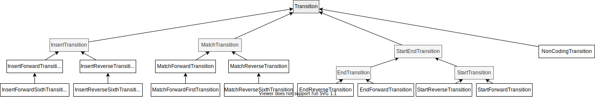
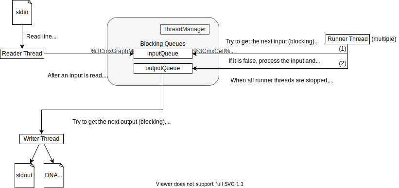

# Verslag Project Computationele Biologie
# Robbe Van Herck

## Proces

In dit deel ga ik in grote lijnen de verschillende stappen beschrijven die ik
ondernomen heb om tot deze versie van JavaFragGeneScan te geraken.

### Analyse FragGeneScan

Als eerste ben ik door de code van de originele FragGeneScan implementaties
gegaan om een beeld te hebben van de effectieve implementatie. In de
[paper][fgs-paper] staat namelijk weinig tot niets vermeld hierover. De
HMM-structuur die ik daaruit gevonden heb is te zien in [figuur
1](#figuur-1-hidden-markov-model). Deze verschilt lichtjes van degene die in de
paper staat, aangezien D-staten niet effectief als staten gezien worden, maar
afgeleid worden uit transities van M- naar M-staten (analoog voor M'). Daarnaast
zijn er ook transities tussen de verschillende END en START states rechtstreeks,
die niet getekend zijn in de paper.

Hieruit kon ik dus afleiden dat elke transitie een transitie-kans en een
emissie-kans heeft. Voor transities die binnen een GENE(') staat blijven of ze
niet betreden is deze transitie-kans af te lezen uit de input-file. Voor
transities die deze wel betreden of verlaten is deze kans het product van twee
verschillende (binnen- en buiten-) kansen.

Mijn grootste probleem met de originele code was het gebrek aan structuur en
documentatie. Om dit op te lossen heb ik besloten om een volledig nieuwe implementatie
te maken die deftig gedocumenteerd en gestructureerd zou zijn.

### Keuze van programmeertaal

Ik heb gekozen voor Java omdat de strikte typering van Java ervoor zorgt dat
er altijd een rigide structuur gaat zijn in de code. Omdat ik hier ook nog eens
de strenge linter SonarLint bij genomen heb werd ik meer gepusht om propere en
gedocumenteerde code te schrijven.

### Structuur

De algemene structuur van het programma is te zien in [figuur
2](#figuur-2-algemene-structuur).

Ik heb gekozen om de bestanden in te lezen in
een Repository-structuur zodat deze maar 1 keer ingelezen moeten worden bij het
opstarten en dat daarna elke runner-thread zijn eigen instantie van de
parameters kan halen uit de repositories en met een leesbare interface
gebruiken.

Daarnaast wordt het proces van het Viterbi-algoritme voorgesteld door
de ViterbiAlgorithm klasse die de stappen bijhoudt als een gelinkte lijst van
ViterbiStep-klassen. Deze ViterbiStep heeft een lijst met PathProbabilities, de
combinatie van de vorige staat en de kans om in de staat te zijn op dat moment.

De transities worden gedaan door de Transition klassen, de structuur hiervan
staat in [figuur 3](#figuur-3-transitie-structuur). Deze klassen zijn
verantwoordelijk voor het invullen van de PathProbabilities in de ViterbiStep.

Om de threads te regelen is er een ThreadManager klasse die de threads met de
RunnerThreadRunnable, WriterThreadRunnable en ReaderThreadRunnable start.
Daarnaast heeft deze ThreadManager ook de input- en outputqueue die ervoor zorgt
dat de threads zo min mogelijk van elkaar afhankelijk zijn. Een meer uitgebreid
overzicht staat in [figuur 4](#figuur-4-threads-model).

## Vergelijking FragGeneScan en JavaFragGeneScan

### Documentatie en linting

De algemene structuur van JavaFragGeneScan staat gedocumenteerd in de [figuren
onderaan dit document](#figuren) en in [het vorige deel](#structuur). Daarnaast
is elke functie gedocumenteerd met JavaDoc-annotaties en hebben ze namen die
naar mijn mening descriptief genoeg zijn om een idee te hebben wat ze doen. Als
SonarLint het volledige project analyseert vindt het op dit moment 2 meldingen,
beide zijn "Cognitive Complexity of methods should not be too high". Dit komt
omdat de backTrack en de initiële ViterbiStep setup complexe functies zijn. Door
deze te refactoren zou de leesbaarheid verminderd kunnen worden.

### Performantie

| Runtime op 1 thread          | FGS     | JFGS    |
|:----------------------------:|:-------:|:-------:|
| HiSeq_input.fa / illumina_10 | 5,518s  | 6.487s |
| NC_000913-454.fna / 454_10   | 13,285s | 14.646s |

| Runtime op 4 threads         | FGS    | JFGS   |
|:----------------------------:|:------:|:------:|
| HiSeq_input.fa / illumina_10 | 1,857s | 3.871s |
| NC_000913-454.fna / 454_10   | 5,013s | 6.207s |

Zoals te zien is in de bovenstaande tabel is JavaFragGeneScan over het algemeen
trager dan FragGeneScan, maar dit is deels te verklaren door de overhead van de
programmeertaal. Daarnaast was dit ook voor mij geen prioriteit. Mijn focus lag
meer op de leesbaarheid en documentatie van de code. Het was natuurlijk wel
nodig om binnen redelijke tijd een resultaat te krijgen en de verschillen in
tijd zijn niet zo significant groot.

Uit deze waarden leid ik ook af dat mijn programma een langere setup-tijd heeft,
aangezien de runtime niet proportioneel toeneemt met het aantal inputs, maar wel
afneemt met het aantal threads.

### Testen

Voor een deel van de code heb ik unit tests geschreven met JUnit, deze waren
niet bedoeld om de volledige codebase te coveren, maar eerder checks voor mezelf
zodat dingen die gebroken en opgelost waren niet opnieuw zouden breken door
andere dingen aan te passen. Op dit moment heb ik in totaal 81% class coverage
volgens IntelliJ.

## Figuren

### Figuur 1: Hidden Markov Model

### Figuur 2: Algemene structuur

### Figuur 3: Transitie-structuur

### Figuur 4: Threads model

[fgs-paper]: https://academic.oup.com/nar/article/38/20/e191/1317565
"FragGeneScan: predicting genes in short and error-prone reads"
